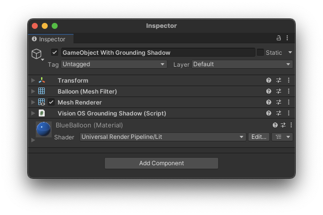
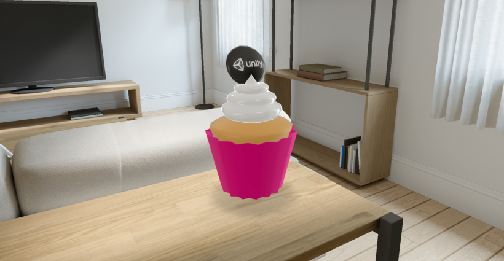

# Grounding Shadows

The **VisionOS Grounding Shadow** component provides a hint to the platform to cast a shadow from this object onto surfaces below, as if from a directional light pointing straight downwards.  The object must have a `MeshRenderer` component.  The visionOS Grounding Shadow component acts as a direct proxy to RealityKit's [GroundingShadowComponent](https://developer.apple.com/documentation/realitykit/groundingshadowcomponent) on visionOS, and is ignored on other platforms, including Unity play mode.

