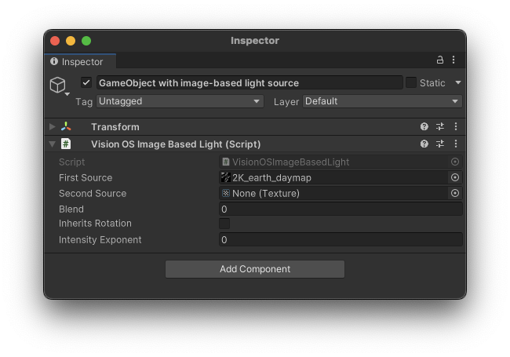
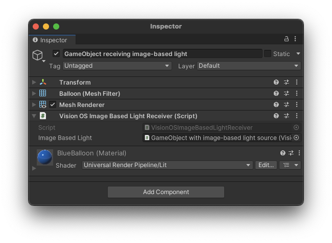

# Image Based Lighting

The **VisionOSImageBasedLight** and **VisionOSImageBasedLightReceiver** components provides a hint to the platform to set a custom image based light (IBL) texture.  In visionOS, this maps directly to the [ImageBasedLightComponent](https://developer.apple.com/documentation/realitykit/imagebasedlightcomponent).

The `VisionOS Image Based Light` component defines the texture used as a light with the following properties:

| **Property** | **Description** |
| --- | --- |
| **First Source** | The first IBL texture to use.  |
| **Second Source** | The second IBL texture to use. |
| **Blend** | The blend parameter (0 for entirely the first texture, 1 for entirely the second). |
| **Inherits Rotation** | Whether the IBL inherits the rotation of the object to which it is attached. |
| **Intensity Exponent** | The power of two by which to scale the light intensity. |

The IBL textures may be either 2D equirectangular (latitude/longitude) or cube maps.  None, either, or both **First Source** and **Second Source** may be specified.  If both are specified, the two textures are blended together according to the **Blend** parameter: for example, a blend value of 0.25 would include 25% of the first source and 75% of the second.  Note that the blend value is not clamped to [0, 1]; similar to [LerpUnclamped](https://docs.unity3d.com/ScriptReference/Mathf.LerpUnclamped.html), values outside the range of [0, 1] will amplify the difference between the two sources.

## Image Based Light Receiver

This component works in tandem with the `VisionOS Image Based Light Receiver` component to customize the image based lighting on an object or tree of objects.  In visionOS, this maps directly to the [ImageBasedLightReceiverComponent](https://developer.apple.com/documentation/realitykit/imagebasedlightreceivercomponent).

Place this component on the GameObject you wish to be affected and set the `Image Based Light` property to an instance of `VisionOS Image Based Light` within the scene.  All `MeshRenderer` instances on the GameObject and its descendants will use the referenced IBL.

