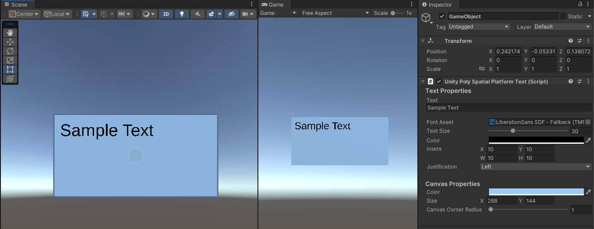

# Platform Text Rendering

PolySpatial supports text rendering across all platforms using the [TextMesh Pro](https://docs.unity3d.com/Manual/com.unity.textmeshpro.html) package. PolySpatial uses the material for the assigned font and a mesh generated by TextMesh Pro to create an item renderable on any platform. This works fine as a general mechanism, but limits the ability of the developer to leverage platform specific text rendering features or support.

To address this, PolySpatial provides a new `VisionOSNativeText` component that you can add to a `GameObject` instance. This component will allow you to leverage some platform specific features for text rendering, as well as support for direct platform rendering. Not all features in the component will be supported on all platforms, but PolySpatial makes a best effort attempt to match as much as possible to keep a high level of fidelity.

It's important to note that this component is not in any way compatible with `TextMesh Pro`. You will need to decide if you want to use one or the other. Any attempt to assign them both to the same `GameObject` will result in an error, and the removal of the PolySpatial component.

## TMP Font Serialization
Because font assets are big, and there are many dependencies in each asset, there is no good way to get the font asset over to the platform side. The solution presented here relies on Unity JSON serialziation coupled with replacement of instance ids with asset ids. When the platform instance gets one of these serialized assets, it will basically do the reverse asset->instance id replacement using local assets previously sent to it. In this way we maintain no only the original font info, but all linkages to weight table instances and fallback instances.

## About fonts and matching

PolySpatial will use the assigned TextMesh Pro font asset to render the text when run on a compatible platform. For platforms where Unity is unable to use TextMesh Pro and must rely on platform specific support, we use the following heuristic to get the best font match possible:

1) If we have the actual font that was used to generate the TMP Font asset, we will send that font over to the platform and attempt to use it to create the necessary font resources.
2) If that should fail, or we don't have the font to send, then we will use the face information of the TMP Font asset to generate a font name we can use to find a matching font.
3) If that fails, then we will fallback to the system font.

For 1 & 2, we will use the font information to find matching bold, italic or bold and italic fonts. For 3 we don't have enough information at this time to determine if the font should be bold or italic.

In all cases we will use the font size requested to get the correct display size on the platform.

## Build management of font resources
The TMP Font to Font mapping is built up by actions taken but the developer whenever they assign a font to a text component instance. Once we notice a change, we take the TMP Font asset, find the Font associated and add this to the map. We then do that for each weight table entry and each fallback entry, if available. This works for assigned fonts, but it is entirely possible for the user to change the font on the component at runtime, in which case we need to be able to find the Font then as well. Because we don't know what that may be, we have to make sure that we have everything mapped that might be possibly used at runtime. To this end, we have a build processor that will iterate over every TMP Font asset in the project and add them to the mapping if not already there.

## Platform Text Component Features

The `VisionOSNativeText` component provides the following features:

| Feature | Description                                                                                                                                                                               |
|---------|-------------------------------------------------------------------------------------------------------------------------------------------------------------------------------------------|
|Text| The text to be displayed.                                                                                                                                                                 |
|Font Asset| The Text Mesh Pro (TMP) font asset used for rendering of the text.|
|Text Size| The size of the text, in points.                                                                                                                                                          |
|Text Color| The color to use to render the text.                                                                                                                                                      |
|Insets| Left, Top, Right and Bottom margin insets from the edges of the canvas. Used to provide some buffer around the text.                                                                      |
|Justification| The justification to use for the text. Possible Values are Left, Center, Right, Justified and None.                                                                                       |
|Canvas Background Color| The color of the canvas.                                                                                                                                                                  |
|Canvas Size| The width and height of the canvas, in points. **NOTE** Not currently supported for Unity platform rendering.                                                                             |
|Canvas Corner Radius| The size of the radius used to generate rounded corners on the canvas.                                                                                                                    |
