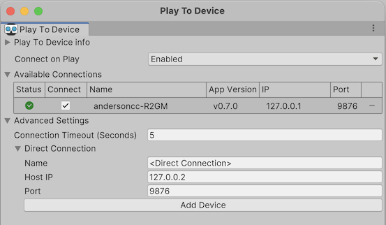
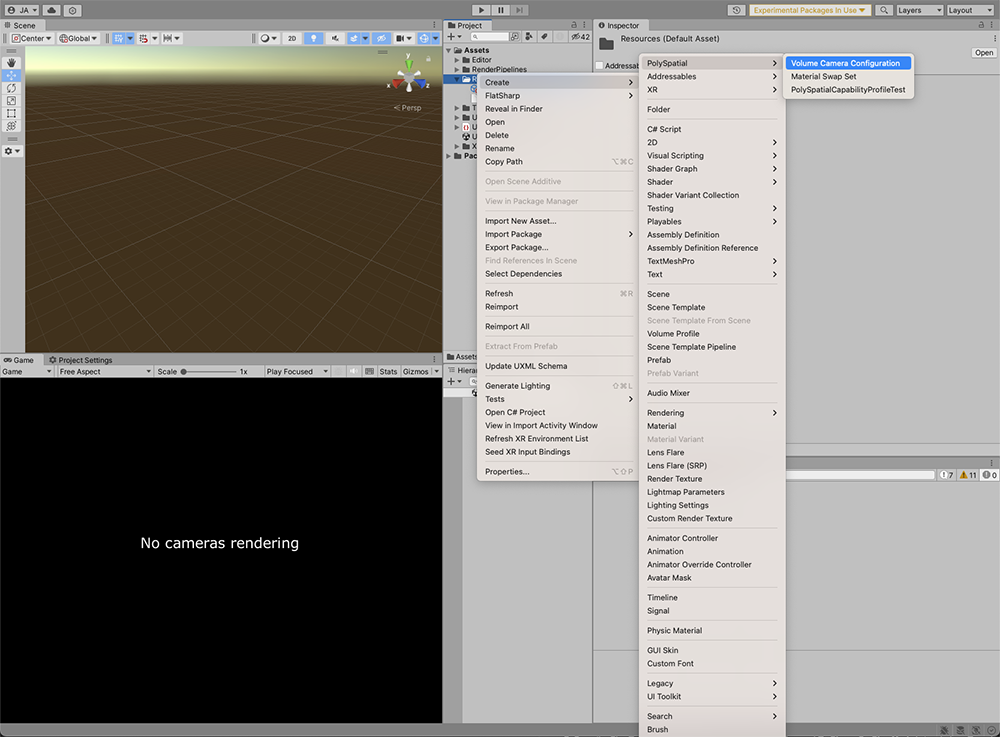
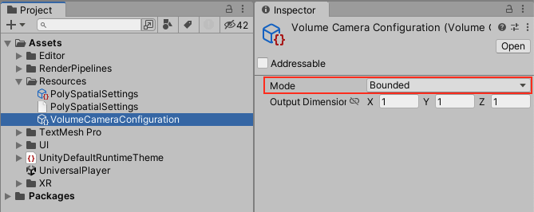
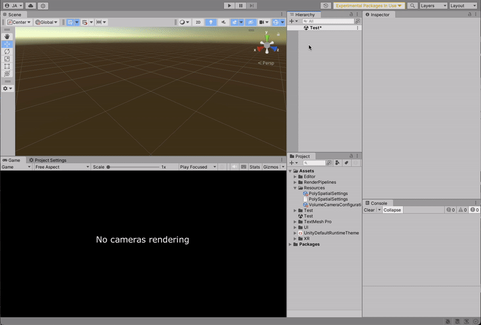
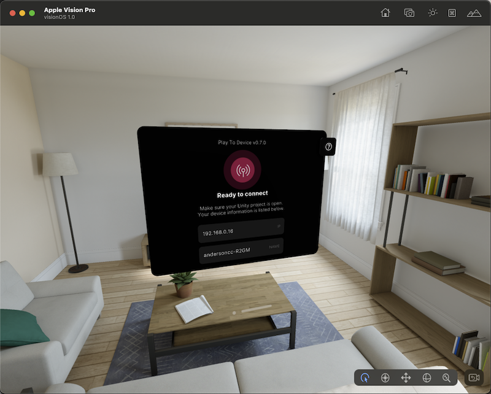

# Play to Device
The Play to Device feature drastically improves iteration and debugging workflows. it enables you to:

* Efficiently iterate and live preview your content across the Unity editor on the visionOS simulator or the Apple Vision Pro device
* Deploy your content without rebuilding an Xcode project
* Access Unity editor’s play mode features on the visionOS simulator and Apple Vision Pro device

This feature is delivered through the Play to Device Host application, which can be installed on the visionOS Simulator or an Apple Vision Pro device. With the Play to Device host running, you can press Play in the Unity Editor and see your content appear in the simulator or on device, rendered by RealityKit. No intermediate builds are required.

 Any changes you make in Unity Editor - such as creating game objects, modifying inspector values, updating and recompiling shader graphs, etc. - will be synchronized to the simulator/device in real time, and any interactions you perform on the host will be synchronized back to the editor.

**NOTE**: Loading a scene during runtime is currently not supported on Play to Device.

## Requirements
Depending on how you are running your application, you will need to install the Play to Device Host on either the visionOS Simulator or an Apple Vision Pro device. 

* For running the Play to Device Host on the _visionOS simulator_ you can find the Xcode .app files in the [Following link](https://drive.google.com/drive/u/0/folders/1ZmWoS6NhrrmvabYia79hlvbyPV1mUN2p).
* For running the Play to Device Host on an _Apple Vision Pro device_ you can find the TestFlight link in the [Following link](https://testflight.apple.com/join/FVMH8aiG).

**It is important to note that the Play to Device Host must match your PolySpatial package version exactly.** Refer to the [Requirements page](Requirements.md#requirements) for more information about the specific editor versions supported depending on the PolySpatial package version you are running.

## First Time Setup - visionOS Simulator
To install the host app for the visionOS simulator:

1. Download the “**PlayToDeviceHost.app.zip**” to your Apple Silicon Mac. See the Compatibility Matrix above to identify the right version given your PolySpatial version. 
2. Extract the zip file revealing “**PlayToDeviceHost.app**” in Finder.
3. Start the visionOS simulator, either by going to **“Xcode > Open Developer Tool > Simulator**” within Xcode, or using Spotlight (command+space) and typing “simulator”.
4. When the simulator is running, you can see the home screen with various app icons. Drag “**PlayToDeviceHost.app**” from the Finder window into the simulator window.
5. After a few seconds, you should see “**PlayToDeviceHost**” appear as one of the app icons on the home screen. Note that you may have to scroll the app list to see it.

## First Time Setup - visionOS Hardware
To install the host app for an Apple Vision Pro device:

1. Follow the TestFlight invite link on your computer or smartphone (or in Safari on the device). You should see an invite code. See the **Compatibility Matrix** above to access a link compatible with your PolySpatial version. 
2. Open the TestFlight app on your Vision Pro device, signing into your Apple account if necessary.
3. Tap “**Redeem Code**” in the TestFlight app.
4. Enter the code you saw in your browser after following the invite link.
5. Tap “**Download**” in the TestFlight app after reading the build information and release notes.
6. After a few seconds, either tap “**Open**” from TestFlight or navigate to the Play To Device Host application that now appears on your home screen.

## First Time Setup - Unity Editor
Once you've installed a host app for device or simulator (see above):

1. Launch the PlayToDeviceHost app in your device or the Apple VisionOS simulator.
2. In the Unity Editor, open the Play to Device Editor window via the main menu under  \
**Window > PolySpatial > Play to Device**.
3. If the Play to Device host app is running on a device that shares the same LAN as your Unity Editor (or is running locally on the same machine), its connection will be automatically detected and you can jump to step **4**. Otherwise, follow the steps below to add a direct connection:
   1. Open the **Direct Connection** section inside the **Advanced Settings** foldout.
   2. Set a **Host Name** that uniquely identifies the host app for you.
   3. Insert the IP address and port that maps to the host app launched at step **1**.
   4. Click the **Add Device** button.
4. Select the desired host app to connect by checking the **Connect** toggle in the **Available Connections** list.
5. Make sure that **Connect on Play** is **enabled**.
6. Enter **Play mode** in the Unity Editor. The Unity Editor will connect to the host and begin streaming your experience to the host in real time. You can then view, play, or interact with your experience via either editor or device; changes and interactions will automatically stay in sync.

If you notice that your connection is timing out, you can increase the connection timeout in the **Advanced Settings** of the Play To Device Editor Window. The default timeout is 5 seconds.

**NOTE**: If you select multiple connections at once, content will be streamed to all selected hosts simultaneously.

## Subsequent Usage

After initial setup, your content will be synced to the host app each time you press play, as long as the **Connect on Play** is **enabled**, and the host remains live. 

## Troubleshooting
For troubleshooting issues refer to the [Play to Device troubleshooting section in the FAQ](FAQ.md#play-to-device-host)

# Tutorial: Previewing a cube

To preview an application in the Play To Device host:

1. Create a new volume camera configuration asset by right clicking in the project view and selecting **Create > PolySpatial > Volume Camera Configuration**.

**Note:** Make sure the `Volume Camera Configuration` asset is in the `Resources` folder.
2. Set the created volume camera configuration _mode_ to `Bounded`

3. On a new empty scene create an Empty game Object, add a volume camera component to it and set the Volume camera configuration to the one just created.

4. Create a small cube in the scene and place it inside the volume camera bounds.

5. Open the Play To Device host in either the visionOS Simulator or a Vision Pro device.

6. Open the Play To Device _Editor Window_ and make sure **Connect on Play** is enabled. To no longer stream to the Play To Device and return to Game View, simply close the Play To Device Editor Window or disable the **Connect on Play** property.

7. With the Play To Device host open, click the Play button in the Editor. The application should begin running both within the editor and in the host app.

# Upgrading/Downgrading TestFlight versions of PlayToDevice

As explained above, you must use a version of the Play to Device Host app that matches the version of the PolySpatial packages used in the Editor. This means that you may need to upgrade/downgrade the version of the app on your device depending on the version of PolySpatial you have in your project. When using the link to install the app for the first time, the latest version will be installed.
- To upgrade to the latest version, simply open the TestFlight app, find `Unity Play to Device Host` in the list, and tap `Upgrade`.
- To downgrade or upgrade to any version other than the latest, tap the title of the `Unity Play to Device Host` app. This will bring you to a new view with more information.
    - In the app details view, tap `Previous Builds`
    - Tap the version number which corresponds to the version of PolySpatial in your project
    - In the build details view, tap `Install`

You can find more information about TestFlight and how to test previous builds in the [official documentation](https://testflight.apple.com/#testing-previous-builds)
