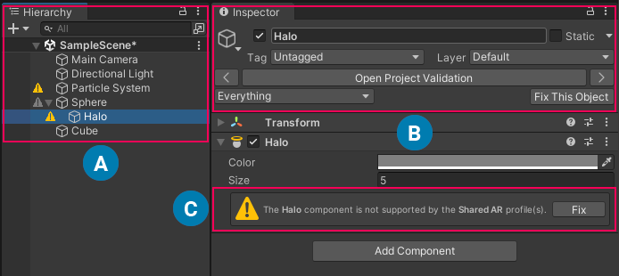

# PolySpatial Validation

## Project Validation

This section covers several settings checks under your Unity project when developing for PolySpatial XR devices.

The [Project validation](https://docs.unity3d.com/Packages/com.unity.xr.core-utils@latest?subfolder=/manual/project-validation.html) system helps you avoid common Scene and Project configuration issues you might encounter depending on the packages installed and the platform you are building for since not all Unity components are fully supported by Unity PolySpatial XR.

Some features are partially supported and others are not supported at all. The Project validation system in PolySpatial XR helps you to detect and fix these unsupported features and configurations in your scenes. The system has a set of [Project Validation](https://docs.unity3d.com/Packages/com.unity.xr.core-utils@latest?subfolder=/manual/project-validation.html) rules to evaluate the components of your opened Scenes.

## Scene Validation

### Hierarchy Issue icons (A)

When a component fails to pass one or more PolySpatial XR Scene Validation rules, the associated GameObject will have a yellow warning icon in the Hierarchy view and its root GameObject will have a greyed out warning icon. You can click in the grayed out warning icon to select the first child GameObject with an issue.

### Inspector issues header (B)

The Scene Validation system will automatically display an issue header in the Inspector of GameObjects that fail any validation rule. 

The issues header has buttons to navigate between GameObjects with issues or lets you open the Project Validation window to see all issues in your project and opened scenes. 

The availability of some features and components is dependent on the visionOS application type that your scene is targeting. The dropdown button labeled **Everything** in the image, allows you to choose the application types to use for validation.

The **Fix this Object** button automatically fixes all validation issues in the currently selected GameObject. The **Hide/Show Alerts** button will hide or show the Component issues in all the GameObjects.

### Per Component Inspector issue (C)

The Scene Validation system automatically displays issue messages in the Inspector of Components that fail any Validation rules. 

The Component at hand that has one or more issues will contain a message explaining the issue. 

When pressing the **Fix** button, Unity will automatically fix the issue in the Component at hand; When pressing the **Edit** button, Unity will take you to the appropriate place in the Editor where you can correct the problem in your project. Both the **Fix** and **Edit** buttons provide tool tips that explain steps to manually correct the issue.

## Shader Graph Validation
Shaders and materials can be authored for visionOS via Unity ShaderGraph. Behind the scenes, these shader graphs are converted into MaterialX. While MaterialX is very expressive, some Shader Graph nodes have no analog in MaterialX. Within the Shader Graph editor, unsupported nodes will be indicated by the presence of a `#` symbol. Please also refer to [Shader Graph Support](ShaderGraph.md) for information about which nodes are currently supported.

## Runtime Validation
### Volume Camera
In order to display content on visionOS, your scene must include at least one VolumeCamera. If no such volume camera exists, the runtime will automatically create an unbounded VolumeCamera at the origin to ensure some content appears. If this behavior is undesirable (for example, because you create your VolumeCamera procedurally in script after initialization), uncheck **Edit &gt; Project Settings &gt; PolySpatial &gt; Enable Default VolumeCamera**.

### PolySpatial Layer
In Play Mode, the PolySpatial runtime attempts to approximate the decoupling of simulation and render objects by creating a parallel hierarchy of "backing" GameObjects, then displays these objects (rather than your simulation GameObjects) in the Game view. This requires the creation of a dedicated PolySpatial layer in your scene - which will be created when needed. However, if no such already layer exist *and* there are no free layers, the PolySpatial runtime will not initialize when you enter Play Mode, and you will instead get vanilla Unity rendering.
