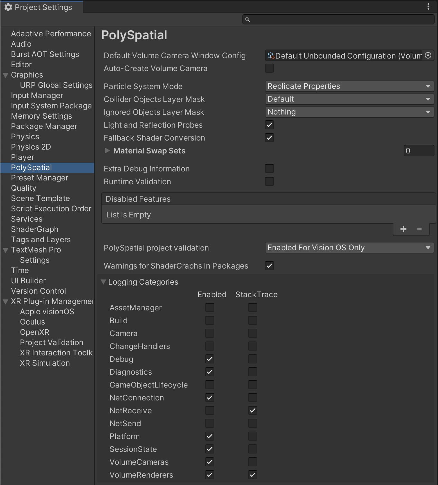

# PolySpatial Settings

To access the PolySpatial Settings window, go to: `Edit > Project Settings > PolySpatial Settings` in the Unity Editor. 

The following settings are available:

| Setting                               | Description                                                                                                                                                                                                                                                                                                                                      |
|---------------------------------------|--------------------------------------------------------------------------------------------------------------------------------------------------------------------------------------------------------------------------------------------------------------------------------------------------------------------------------------------------|
| Default Volume Camera Window Configuration | Specifies the default [`Volume Camera Window Configuration`](VolumeCamera.md#volume-camera-window-configuration-assets) to be used when no configuration is set on a Volume Camera component.                                                                                                                                                           |
| Auto-Create Volume Camera             | When enabled, if there is no Volume Camera present during any frame, a Volume Camera is created using the default settings. Disable this to directly manage all Volume Camera aspects, such as creating Volume Camera from a script.                                                                                                             |
| Particle System Mode                  | How particle systems are handled:  - **[Replicate Properties:](SupportedFeatures.md#supported-modes)** Unity particle system properties are mapped to native particle system properties.  - **[Bake to Mesh:](SupportedFeatures.md#supported-modes)** Particle systems are baked to a mesh every frame and rendered as regular meshes. |
| Collider Objects Layer Mask           | Only Colliders in these layers are replicated to the target for input.                                                                                                                                                                                                                                                                           |
| Ignored Objects Layer Mask            | GameObjects in these layers are be replicated to the target.                                                                                                                                                                                                                                                                                     |
| Light and Reflection Probes           | Replicate light and reflection probes. **Warning**: Enabling this option can have a large performance impact.                                                                                                                                                                                                                                    |
| Fallback Shader Conversion            | When enabled, a number of legacy built-in shaders are replicated on a best-effort basis.                                                                                                                                                                                                                                                         |
| Material Swap Sets                    | The list of Material Swap Set assets to apply at runtime.                                                                                                                                                                                                                                                                                        |
| Extra Debug Information               | When enabled, additional GameObject information (such as names) are replicated.                                                                                                                                                                                                                                                                  |
| Runtime Validation                    | When enabled, the runtime validation layer is enabled. This layer checks for common problems.                                                                                                                                                                                                                                                    |
| Disabled Features                     | This list allows you to disable specific Unity features from being replicated to the target. This is useful for debugging or occasionally performance.                                                                                                                                                                                           |
| PolySpatial project validation        | Specifies when the PolySpatial validation rules are checked:  - **Enabled For VisionOS Only**:  Only when the project's build target is set to visionOS. - **Enabled For All Platforms**:  Always enabled. Use this settings for cross-platform projects if you want to be alerted to potential incompatibilities with the PolySpatial platform. - **Disabled**: Do not run PolySpatial validation checks.
| Warnings For ShaderGraphs in Packages | When enabled, warnings generated by MaterialX conversion for Shader Graphics in packages are reported to the console.                                                                                                                                                                                                                            |
| Logging Categories                    | Specifies which PolySpatial subsystems produce log messages and stack traces.                                                                                                                                                                                                                                                                    |
