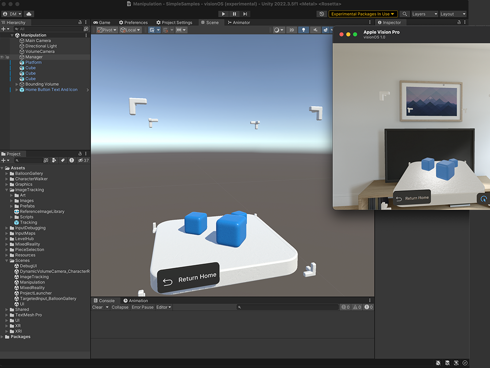

## Introduction
visionOS enables 3D multi-tasking experiences that seamlessly integrate with the real world and coexist alongside other virtual content. This opens a world of new possibilities around personal productivity, lifestyle and entertainment applications and a whole new market for developers. However, it also introduces new challenges around multitasking and interactions with the physical. Unity PolySpatial is a collection of technologies targeted to address this new platforms and its unique challenges  

## Requirements
Unity PolySpatial and visionOS support is only available to Unity Pro, Unity Enterprise, and Unity Industry users. [Learn more about these plans](https://unity.com/pricing).

To learn about the requirements for visionOS and PolySpatial in Unity, see [visionOS PolySpatial Requirements & Limitations](Requirements.md).

## visionOS Platform Overview
You can find information about Unity's support for visionOS in the [visionOSPlatformOverview](visionOSPlatformOverview.md). 

### visionOS Application Types
Unity supports several different application types on visionOS, each with their own advantages:
* If you're interested in creating fully immersive virtual reality (VR) apps for visionOS, refer to [Fully Immersive VR apps on visionOS](VRApps.md) for more information.
* If you're interested in creating immersive mixed reality (MR) apps for visionOS, refer to [PolySpatial MR Apps on visionOS](PolySpatialMRApps.md) for more information. These apps are built with Unity's newly developed PolySpatial technology, where apps are simulated with Unity, but rendered with RealityKit, the system renderer of visionOS.
* If you're interested in creating content that will run in a window on visionOS, refer to [Windowed Apps on visionOS](WindowedApps.md) for more information.

## Resources
**New users** should find the [Getting Started](GettingStarted.md) page an ideal place for an introduction to visionOS and PolySpatial. It guides you through setup, prerequisites, iterating, previewing, building, and debugging with with [development and iteration](DevelopmentAndIteration.md) basics and building your first app for visionOS.

**All developers** should familiarize themselves with [development and iteration](DevelopmentAndIteration.md) on this platform. This section covers the nuts and bolts of setting up PolySpatial for visionOS, iterating, [previewing](PlayToDevice.md), building, and debugging. 

**Content Creators** should consult [PolySpatial XR Project Validation](PolySpatialXRProjectValidation.md), which offers an overview of the new project validation system introduced for visionOS and PolySpatial. This system provides helpful assistance on supported and unsupported features when developing Unity apps for visionOS and PolySpatial

To **find answers and workarounds**, please consult the [FAQ](FAQ.md), which presents answers to many common questions about design, implementation, and use of the PolySpatial XR package.

The [Glossary](Glossary.md) can help clarify **technical terminology** introduced for visionOS and PolySpatial and used throughout this documentation.

Refer to the [PolySpatial Scripting API](https://docs.unity3d.com/Packages/com.unity.polyspatial@latest?subfolder=/api/index.html) for code documentation.
