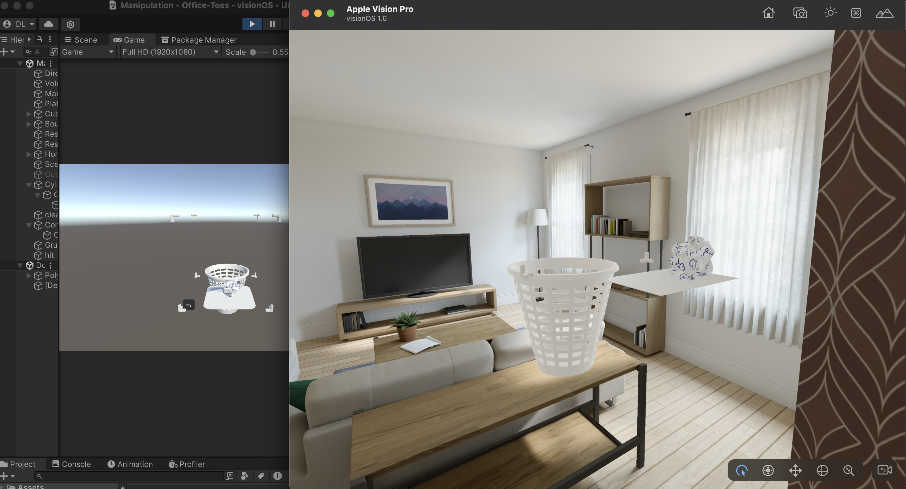

# Office Toss

**An augmented-reality arcade paper-toss tech demo for Apple Vision Pro.**

Built with **Unity 2022.3 LTS, C#, and PolySpatial**, Office Toss explores bringing a familiar arcade interaction into spatial computing: toss paper into office bins and aim for the perfect shot.



## Project at a glance

| | |
| --- | --- |
| Platform | visionOS / Apple Vision Pro |
| Engine | Unity 2022.3 LTS |
| Language | C# |
| Spatial tooling | Unity PolySpatial |
| Scope | Tech demo |
| Initial development | 14 hours |

## Explore the implementation

- [Assets](Assets): gameplay source, scenes, and assets.
- [Packages](Packages): Unity package dependencies.
- [ProjectSettings](ProjectSettings): project configuration.

## Open the project

```bash
git clone https://github.com/DallenLarson/Office-Toss.git
```

Open the cloned project with Unity 2022.3 LTS. Review the package dependencies and platform configuration before building.

The original development setup lists Apple silicon hardware, Unity Pro, and an Apple Developer account. Building and deploying for visionOS also requires the matching Apple and Unity tooling; requirements and licensing may have changed since this prototype was created.

## About

Created by [Dallen Larson](https://www.dallenlarson.com/) as a rapid spatial-computing prototype.

[Contact](mailto:dallen@dallenlarson.com) · [License](LICENSE)
